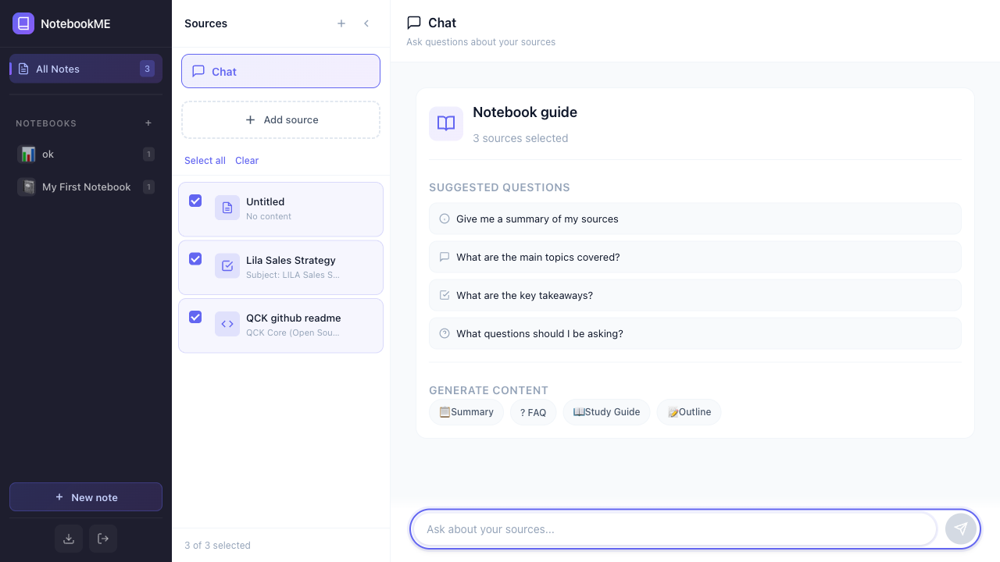
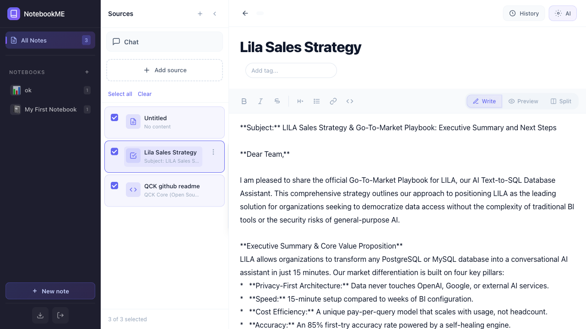
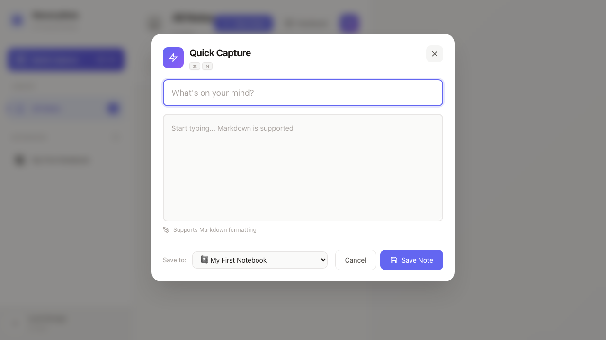

# NotebookME 🧠

**Your Self-Hosted AI Second Brain.**
A private, powerful, and intelligent note-taking application designed to be a simpler, faster alternative to NotebookLM and Obsidian.



## ✨ Features

### 📝 Smart Note-Taking
-   **Markdown Support**: Full rich-text editing with automatic markdown formatting.
-   **Distraction-Free**: Clean, minimalist interface focused on your thoughts.
-   **Quick Capture**: Capture ideas instantly without losing flow.

### 🤖 AI Integration (The "Exocortex")
Your personal AI assistant is woven into every note:
-   **Chat with Context**: The AI knows your notes. Ask questions, find connections, or summarize entire notebooks.
-   **Smart Action Bar**:
    -   **➕ Append**: Add AI ideas to the end of your note for brainstorming.
    -   **📍 Insert**: Seamlessly expand on points right where your cursor is.
    -   **🔄 Replace**: Rewrite sections or entire notes to improve clarity/tone.



### 🛡️ Privacy & Safety
-   **100% Self-Hosted**: Your data lives on **your** device/server (SQLite). No vendor lock-in.
-   **Version Control**: "Time Travel" for your notes. Every AI edit creates a secure checkpoint, so you can always revert changes.
-   **Ownership**: You own the code (`index.html`, `server.js`) and the data (`data/memorynote.db`).

## 🚀 Getting Started

### Prerequisites
-   Node.js (v18+)
-   NPM

### Installation

1.  **Clone the repository**
    ```bash
    git clone https://github.com/rajpootathar/NoteBookMe.git
    cd NoteBookMe
    ```

2.  **Install dependencies**
    ```bash
    npm install
    ```

3.  **Configure Environment**
    Copy the example env file and set your secrets:
    ```bash
    cp .env.example .env
    ```
    *Edit `.env` to set your `USER_PASSWORD` and `JWT_SECRET`.*

4.  **Run the Server**
    ```bash
    npm start
    ```
    Access your Second Brain at `http://localhost:3000`.

## 🛠️ Tech Stack
-   **Frontend**: Vue 3 + Vite (PWA)
-   **Backend**: Express.js
-   **Database**: LanceDB (vector database with semantic search)
-   **Embeddings**: all-MiniLM-L6-v2 (local, privacy-first)
-   **AI**: OpenAI-compatible API (configurable)

## 📸 Screenshots

### Intelligent Chat


## 📄 License

This project is licensed under the [Elastic License 2.0 (ELv2)](LICENSE).

You are free to use, modify, and distribute this software, with the following limitations:
- You may not provide this software as a hosted/managed service to third parties
- You may not remove or alter licensing notices

Built with ❤️ for the open internet.
